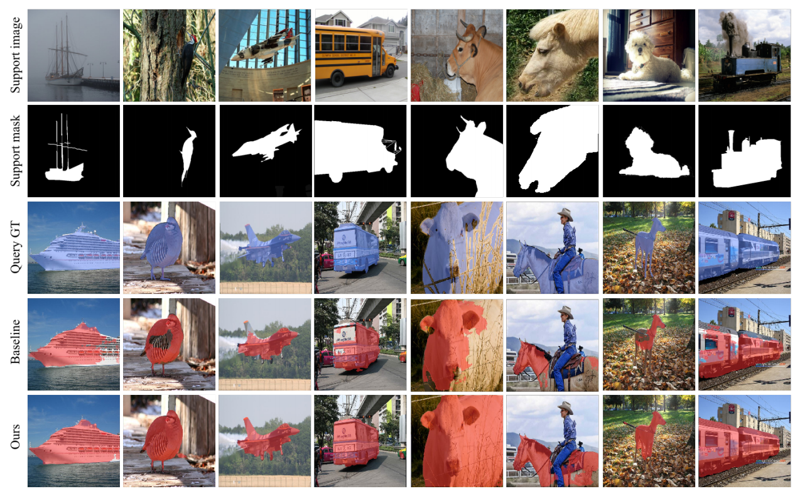

## Quaternion-valued Correlation Learning for Few-Shot Semantic Segmentation
This is the implementation of our paper [**Quaternion-valued Correlation Learning for Few-Shot Semantic Segmentation**](https://ieeexplore.ieee.org/document/9954424) that has been accepted to IEEE Transactions on Circuits and Systems for Video Technology (TCSVT). 

<p align="middle">
    
</p>

## Requirements

- Python 3.7
- PyTorch 1.5.1
- cuda 10.1
- tensorboard 1.14

## Datasets

- PASCAL-5<sup>i</sup>:  [VOC2012](http://host.robots.ox.ac.uk/pascal/VOC/voc2012/) + [SBD](http://home.bharathh.info/pubs/codes/SBD/download.html)

- COCO-20<sup>i</sup>:  [COCO2014](https://cocodataset.org/#download)

  Please see [OSLSM](https://arxiv.org/abs/1709.03410) and [FWB](https://openaccess.thecvf.com/content_ICCV_2019/html/Nguyen_Feature_Weighting_and_Boosting_for_Few-Shot_Segmentation_ICCV_2019_paper.html) for more details on datasets. 


## Test and Train
Using PASCAL-5i as an example

### Training
> #### PASCAL-5<sup>i</sup>
> ```bash
># if you want to use default setting
>python train.py --fold=0
># if you want to use manual settings
> python train.py  --backbone=resnet50 --fold=2  --dataset=pascal  --batch_size=20  
> ```

### Testing

> #### PASCAL-5<sup>i</sup>
> Load the trained model weights and start testing
> ```bash
># if you want to use default setting
>python test.py --fold=0
># if you want to use manual settings
> python test.py --backbone=resnet50 --fold=2 --dataset=pascal --dataset=pascal  --load='best_model_pth'
> ```

## Visualization
<p align="middle">
    
</p>

## References

This repo is mainly built based on [HSNet](https://github.com/juhongm999/hsnet). Thanks for their great work!

# Citation

If you find this project useful, please consider citing:
```
@article{zheng2022qclnet,
  title={Quaternion-valued Correlation Learning for Few-Shot Semantic Segmentation},
  author={Zheng, Zewen and Huang, Guoheng and Yuan, Xiaochen and Pun, Chi-Man and Liu, Hongrui and Ling, Wing-Kuen},
  journal={TCSVT},
  year={2022}
}
```
